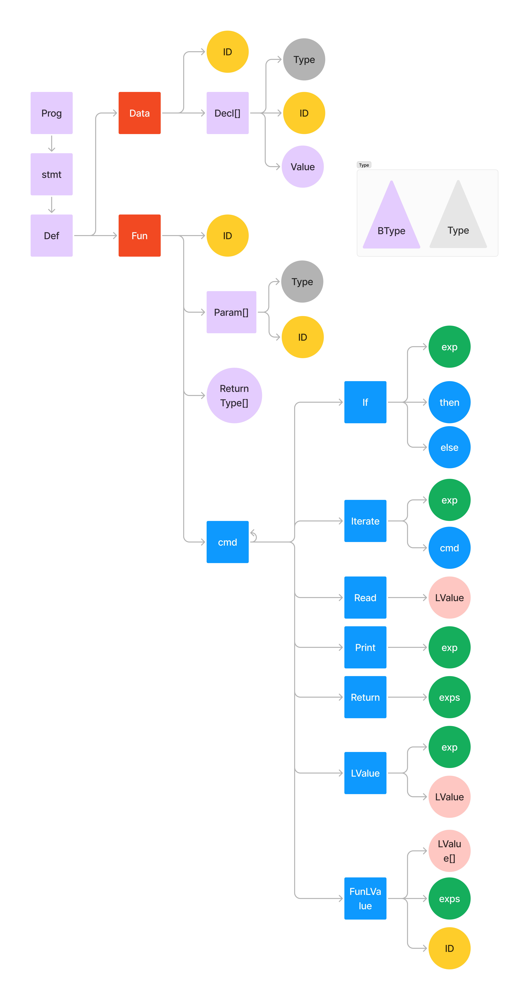

<h1 align="center">
    <b> Java Compiler </b> 
</h1>

<p align="center">
    
  
  
</p>

# Descrição

Este trabalho foi desenvolvido como parte da disciplina DCC045 - Teoria dos compiladores - UFJF, ministrada pelo professor Leonardo Vieira dos Santos Reis.

## Integrantes

- Nome: Charles Lelis Braga -- Matrícula: 202035015
- Nome: Gabriella Carvalho -- Matrícula: 202165047AC

## Informações

- Java version: Foi testado na 21.0.2 e na 17

### How to run

Rode o comando:

```bash
make run -bs
```

### Como rodar apenas o Parser

Caso seja de interesse testar apenas o Parser, basta:

1. Comente a chamada da classe `InterpreterRunner`
2. Altere os diretórios no TestParse.java.

Vale um adendo que o Parser deve funcionar com todos os diretórios de sucesso, inclusive o semântico.


# Estrutura do Projeto




Analisando o diagrama de acordo com a gramática, podemos dizer que: 

- **Prog** (representado por "prog" no diagrama):
    - No diagrama, o `Prog` é o ponto de entrada do programa, que contém uma sequência de declarações (`def`).
- **Def** (representado por "def" no diagrama):
    - A regra `def → data | fun` indica que uma definição (`def`) pode ser uma definição de dados (`data`) ou uma função (`fun`).
- **Data** (representado por "Data" no diagrama):
    - A definição de dados começa com a palavra-chave `data` seguida de um identificador (`ID`) e uma lista de declarações (`decl`), que estão contidas entre `{}`.
    - No diagrama, `Data` leva a um `ID` e uma lista de `Decl[]`, onde cada `Decl` representa uma declaração de tipo de dados com um identificador e um tipo.
- **Decl** (representado por "Decl[]" no diagrama):
    - `decl → ID ‘::’ type ‘;’` significa que cada declaração consiste em um identificador (`ID`) seguido por `::` e o tipo de dado (`type`), terminando com `;`.
    - No diagrama, isso é representado por uma ligação de `Decl[]` a um `ID` e um `Type`.
- **Fun** (representado por "Fun" no diagrama):
    - Uma função é representada por `ID` seguido por uma lista de parâmetros (`params`) opcional, um tipo de retorno (`type`), e uma sequência de comandos (`cmd`) contida entre `{}`.
    - No diagrama, `Fun` leva a um `ID`, uma lista de parâmetros (`Param[]`), um tipo de retorno (`Type[]`), e comandos (`cmd`).
- **Params** (representado por "Param[]" no diagrama):
    - Parâmetros da função são uma lista de pares `ID :: type`, separados por vírgulas.
    - No diagrama, `Param[]` conecta um `ID` ao `Type`.
- **Type** e **BType** (representado por "Type" e "BType" no diagrama):
    - `Type` pode ser um tipo básico (`btype`) ou um tipo de array (`type[]`).
    - `BType` pode ser `Int`, `Char`, `Bool`, `Float`, ou um `ID` referindo-se a um tipo definido pelo usuário.
    - No diagrama, `Type` pode derivar de `BType`.
- **Cmd** (representado por "cmd" no diagrama):
    - Os comandos (`cmd`) incluem estruturas de controle como `if`, `iterate`, operações de leitura e escrita (`read`, `print`), retorno de valores (`return`), e atribuições (`lvalue = exp`).
    - No diagrama, `cmd` pode ser um comando condicional (`If`), laço (`Iterate`), leitura/escrita, retorno, ou uma atribuição de valor (`LValue`).
- **Exp** (representado por "exp" no diagrama):
    - As expressões (`exp`) incluem operadores lógicos, aritméticos, literais, valores lógicos (`true`, `false`), valores nulos (`null`), operações unárias, criação de novos objetos (`new type`), chamadas de função (`ID(exps)`), e acesso a elementos (`lvalue`).
    - No diagrama, `exp` é mostrado como um nó que pode se conectar a várias subexpressões ou valores (`LValue`).
- **LValue** (representado por "LValue" no diagrama):
    - Um `LValue` representa uma expressão que pode aparecer no lado esquerdo de uma atribuição, como um identificador (`ID`), um elemento de array, ou um campo de um objeto.
    - No diagrama, `LValue` conecta-se a `ID`, `exp`, e outros `LValue`.
- **Exps** (representado por "exps" no diagrama):
    - `exps` representa uma lista de expressões, separadas por vírgulas.
    - No diagrama, `exps` é uma coleção de `exp`.


- **EXP** (Expressoes):

- A expressão (`exp`) é o núcleo da linguagem de programação, onde cálculos, operações lógicas, acessos a variáveis, chamadas de função, e outros tipos de operações são realizadas.

- **Tipos de Expressões**:

- **Array Access**: Representa o acesso a um elemento dentro de um array. Provavelmente é expresso por `lvalue[index]`.
- **BinOp**: Representa operações binárias, como soma, subtração, multiplicação, etc., entre duas expressões. No diagrama, os operadores são divididos em dois operandos: `ExprLeft` e `ExprRight`.
- **FunCall**: Representa a chamada de função. É quando você chama uma função com argumentos.
- **New Array**: Refere-se à criação de um novo array, provavelmente usando algo como `new type[]` na gramática.
- **ID**: Refere-se a um identificador, que pode ser uma variável ou nome de função.
- **New Object**: Refere-se à criação de um novo objeto, provavelmente algo como `new ClassName()`.

- **Operadores** (Operators):

- Os operadores são categorizados em operações binárias (`BinOp`) e operações unárias (`Expr`):
    - **BinOp** (operações binárias):
        - **Div**: Divisão (`/`).
        - **Mod**: Módulo (`%`).
        - **Mul**: Multiplicação (``).
        - **And**: E lógico (`&&`).
        - **EQ**: Igualdade (`==`).
        - **Plus**: Adição (`+`).
        - **NotEq**: Diferente (`!=`).
        - **Minus**: Subtração (``).
        - **LessThan**: Menor que (`<`).
    - **Expr** (operações unárias):
        - **Neg**: Negação aritmética (`exp`).
        - **Not**: Negação lógica (`!exp`).

- **Literals**:

- **Int**: Literal inteiro.
- **Null**: Literal nulo.
- **Float**: Literal de ponto flutuante.
- **Bool**: Literal booleano (`true` ou `false`).
- **Char**: Literal de caractere.

- **Ligação entre Operações**:

- As operações binárias no diagrama têm duas subexpressões: `ExprLeft` e `ExprRight`, que representam os operandos esquerdo e direito da operação binária.


- **LValue**:
    - Representa um valor à esquerda de uma atribuição. No diagrama, este é o nó raiz que se ramifica em diferentes tipos de `LValue`.
- **AttrAssignLValue**:
    - Representa um `LValue` que envolve uma atribuição de atributo, ou seja, a modificação direta de um atributo de um objeto. Por exemplo, algo como `obj.attr = valor`.
- **ArrayAccessLValue**:
    - Refere-se ao acesso de um elemento específico de um array. No código, isso seria algo como `array[index] = valor`, onde `array[index]` é o `ArrayAccessLValue`.
- **IdLValue**:
    - Este é o tipo mais simples de `LValue`, representando uma variável simples (identificador). Por exemplo, `var = valor` onde `var` é o `IdLValue`.
- **FunLValue**:
    - Representa um `LValue` que resulta de uma chamada de função. Isso pode ocorrer em linguagens onde funções podem retornar referências que podem ser atribuídas a valores, como em `fun()[index] = valor`.
- **AttrAccessLValue**:
    - Este tipo de `LValue` representa o acesso a um atributo de um objeto sem uma atribuição direta, como em `obj.attr`, onde `obj.attr` pode ser utilizado como um valor à esquerda em uma expressão de atribuição.


Vale um adendo que, no código, existe uma melhor descrição dentro de cada função. Veja um exemplo: 

```java
   /**
 * Representa os comandos da linguagem.
 * 
 * @cmd Comando
 * @Parser ‘{’ {cmd} ‘}’
 * 
 * @cmd Condicionais
 * @Parser if ‘(’ exp ‘)’ cmd
 * @Parser if ‘(’ exp ‘)’ cmd else cmd
 * 
 * @cmd Repetição
 * @Parser iterate ‘(’ exp ‘)’ cmd
 * 
 * @cmd Leitura
 * @Parser read lvalue ‘;’
 * 
 * @cmd Escrita
 * @Parser print exp ‘;’
 * 
 * @cmd Retorno
 * @Parser return exp {‘,’ exp} ‘;’
 * 
 * @cmd Atribuição
 * @Parser lvalue = exp ‘;’
 * 
 * @cmd Chamada de função
 * @Parser ID ‘(’ [exps] ‘)’ [‘<’ lvalue {‘,’ lvalue} ‘>’] ‘;’
 */
public abstract class Cmd extends Node {
	public Cmd(int line, int column) {
		super(line, column);
	}
}
```


# Estrutura de pastas Do AST


```bash	
.
└── ast/
    ├── definitions/
    ├── expressions/
    │   ├── literals/
    │   └── operators/
    ├── lvalue/
    ├── statements/
    │   ├── commands/
    │   └── data/
    ├── types/
    ├── Node.java
    └── SuperNode.java
```


- **ast/**: Diretório principal que contém a estrutura da árvore sintática abstrata (AST) da linguagem.
    - **definitions/**: Contém definições que são usadas na AST, como definições de variáveis, funções, ou outras entidades que compõem a linguagem. Por exemplo: `prog`  ,`fun` ...
    - **expressions/**: Contém os nós filhos do `EXP`. É a parte verde da imagem.
        - **literals/**: Subdiretório com as representações de literais, como números, strings e booleanos.
        - **operators/**: Contém a implementação de operadores, como operadores aritméticos, lógicos, etc.
    - **lvalue/**: Contém elementos que podem aparecer no lado esquerdo de uma atribuição, como variáveis ou acessos a campos de objetos.
    - **statements/**: Contém as declarações da linguagem, que são comandos executáveis.
        - **commands/**: Subdiretório com comandos da linguagem, como loops, condicionais, e outras estruturas de controle de fluxo.
        - **data/**: Armazena elementos relacionados à manipulação de dados, como declarações de inicialização e manipulação de estruturas de dados.
    - **types/**: Contém a definição de tipos usados na AST.
    - **Node.java**: Classe base para os nós da AST, representando os elementos da árvore sintática.
    - **SuperNode.java**.